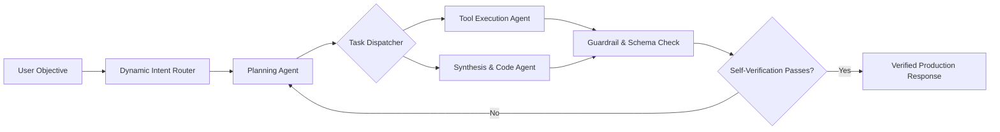
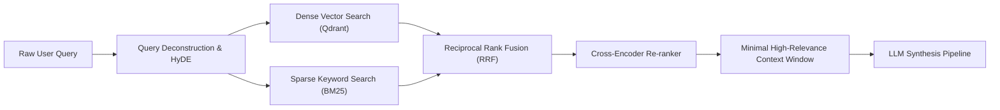

<!-- ═══════════════════════════════════════════════════════════════════════ -->
<!--                    ▓▓▓  CYBERPUNK PROFILE // RAJAN MISHRA  ▓▓▓           -->
<!-- ═══════════════════════════════════════════════════════════════════════ -->

<!-- ── Animated neon header ────────────────────────────────────────────── -->
<p align="center">
  
</p>

<!-- ── Glitch typing subtitle ──────────────────────────────────────────── -->
<p align="center">
  <a href="https://github.com/aiwithrajan">
    
  </a>
</p>

<!-- ── Neon socials ────────────────────────────────────────────────────── -->
<p align="center">
  <a href="mailto:imrajan098@gmail.com"></a>
  <a href="https://linkedin.com/in/rajanmishra01"></a>
  <a href="https://x.com/RajanMi26020288"></a>
  <a href="https://huggingface.co/rajanmishra123"></a>
  <a href="https://github.com/aiwithrajan?tab=repositories"></a>
</p>

<!-- ── Neon divider ────────────────────────────────────────────────────── -->


<!-- ═══════════════════════════════════════════════════════════════════════ -->
<!--                          PROFILE VIEWER                                 -->
<!-- ═══════════════════════════════════════════════════════════════════════ -->

## `▚ PROFILE_VIEWER`

<div align="center">


<br/><br/>


</div>


<!-- ═══════════════════════════════════════════════════════════════════════ -->
<!--                              WHOAMI                                     -->
<!-- ═══════════════════════════════════════════════════════════════════════ -->

## `▚ WHOAMI`

```ts
const rajan: Engineer = {
  role:      "AI Systems Engineer & Full-Stack Architect",
  focus:     ["Autonomous AI Agents", "Multi-Agent Swarms", "Production RAG", "Distributed Systems"],
  building:  "Resilient AI products with hardened tool calling, reliable APIs & low latency",
  backend:   "Python · FastAPI · LangGraph · PyTorch · PostgreSQL · Redis",
  frontend:  "TypeScript · React · Next.js · Tailwind CSS",
  inference: "Quantized Local Models · Tool-Use · Self-Reflective Loops · Structured Output",
  mindset:   "Production-first. Concept → Intelligence → Scale. Fast.",
};
```

### How I Build

| Area | Engineering Focus |
| :--- | :--- |
| **Agentic Systems** | Deterministic tool calling, state machines, self-correcting retry loops |
| **Full-Stack Architecture** | FastAPI/Python microservices paired with dynamic Next.js/React frontends |
| **Retrieval & Search** | Hybrid semantic/keyword search, re-ranking pipelines, dynamic vector routing |
| **System Reliability** | Graceful degradation, streaming SSE/WebSocket UX, telemetry & observability |
| **Open Source** | Fast iteration, high-velocity shipping, community-driven development |


<!-- ═══════════════════════════════════════════════════════════════════════ -->
<!--                           TECH ARSENAL                                  -->
<!-- ═══════════════════════════════════════════════════════════════════════ -->

## `▚ TECH_ARSENAL`

### `Languages & Core`
<div align="center">


</div>

### `AI, LLMs & Agentic Frameworks`
<div align="center">


</div>

### `Full-Stack & Backends`
<div align="center">


</div>

### `Data, Vector Stores & Cloud`
<div align="center">


</div>


<!-- ═══════════════════════════════════════════════════════════════════════ -->
<!--                      ARCHITECTURE SPOTLIGHT                             -->
<!-- ═══════════════════════════════════════════════════════════════════════ -->

## `▚ ARCHITECTURE_SPOTLIGHT`

<details open>
<summary><strong>▸ NeuralSwarm: Multi-Agent Consensus & Autonomous Execution Pipeline</strong></summary>

<br />

**Core Architecture Highlights:**
- Decentralized agent routing utilizing LangGraph state machines and typed schemas
- Real-time tool-calling validation layer with guardrails preventing hallucinated payloads
- Parallelized execution subnets with continuous self-reflective verification checks
- Resilient fallback cascades: primary reasoning models automatically degrade to localized fallback instances on quota limits



</details>

<details>
<summary><strong>▸ HyperRAG: Low-Latency Hybrid Search & Re-ranking Engine</strong></summary>

<br />

**Core Architecture Highlights:**
- Multi-vector indexing leveraging dense embedding models alongside sparse BM25 tokenizers
- Cross-encoder re-ranking pass filtering semantic noise before context injection
- Dynamic sliding window chunking preserving conversational state across long session contexts
- Sub-50ms vector query execution powered by optimized Qdrant indexing



</details>


<!-- ═══════════════════════════════════════════════════════════════════════ -->
<!--                         REPOSITORY MAP                                  -->
<!-- ═══════════════════════════════════════════════════════════════════════ -->

## `▚ REPOSITORY_MAP`

| Track | Repositories & Focus |
| :--- | :--- |
| 🤖 **Autonomous Agents** | [neural-agent-swarm](https://github.com/aiwithrajan/neural-agent-swarm), [auto-code-evaluator](https://github.com/aiwithrajan/auto-code-evaluator), [langgraph-supervisor](https://github.com/aiwithrajan/langgraph-supervisor) |
| 🔍 **RAG & Search Systems** | [hybrid-rag-engine](https://github.com/aiwithrajan/hybrid-rag-engine), [vector-pipeline-stream](https://github.com/aiwithrajan/vector-pipeline-stream), [doc-intelligence-api](https://github.com/aiwithrajan/doc-intelligence-api) |
| ⚡ **Full-Stack & Cloud** | [ai-saas-starter](https://github.com/aiwithrajan/ai-saas-starter), [fastapi-agent-service](https://github.com/aiwithrajan/fastapi-agent-service), [realtime-stream-ui](https://github.com/aiwithrajan/realtime-stream-ui) |
| 🛠️ **Developer Tools** | [dev-toolkit-cli](https://github.com/aiwithrajan/dev-toolkit-cli), [mcp-agent-server](https://github.com/aiwithrajan/mcp-agent-server), [eval-bench](https://github.com/aiwithrajan/eval-bench) |
| 🌐 **Open Source Contributions** | Active contributor across LangChain, Ollama, and Hugging Face ecosystems |


<!-- ═══════════════════════════════════════════════════════════════════════ -->
<!--                        SYSTEM ANALYTICS                                 -->
<!-- ═══════════════════════════════════════════════════════════════════════ -->

## `▚ SYSTEM_ANALYTICS`

<div align="center">


</div>

<div align="center">


</div>

<div align="center">


</div>

<div align="center">


</div>


<!-- ═══════════════════════════════════════════════════════════════════════ -->
<!--                      CONTRIBUTION SNAKE                                 -->
<!-- ═══════════════════════════════════════════════════════════════════════ -->

## `▚ CONTRIBUTION_SNAKE`

<div align="center">
  
</div>

<sub>Auto-regenerates daily via <code>.github/workflows/snake.yml</code>. Run it once from the <strong>Actions</strong> tab to seed the first frame.</sub>


<!-- ═══════════════════════════════════════════════════════════════════════ -->
<!--                           CONTACT                                       -->
<!-- ═══════════════════════════════════════════════════════════════════════ -->

## `▚ TRANSMISSION_CHANNELS`

- **Email** — [imrajan098@gmail.com](mailto:imrajan098@gmail.com)
- **LinkedIn** — [linkedin.com/in/rajanmishra01](https://linkedin.com/in/rajanmishra01)
- **X** — [x.com/RajanMi26020288](https://x.com/RajanMi26020288)
- **GitHub** — [github.com/aiwithrajan](https://github.com/aiwithrajan)

<p align="center">
  
</p>
