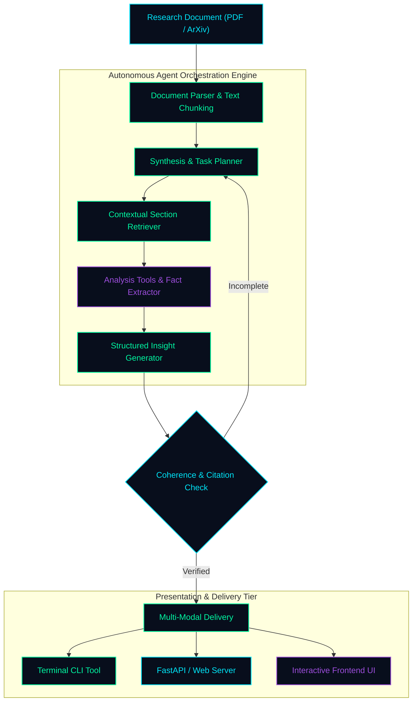

<!-- ═══════════════════════════════════════════════════════════════════════ -->
<!--               ◈ RAJAN MISHRA // AI SYSTEMS & AGENT ARCHITECT ◈            -->
<!-- ═══════════════════════════════════════════════════════════════════════ -->

<div align="center">

  <!-- HOLOGRAPHIC QUANTUM BANNER -->
  

  <br/><br/>

  <!-- TERMINAL TELEMETRY TYPING SUBTITLE -->
  <a href="https://github.com/aiwithrajan">
    
  </a>

  <br/><br/>

  <!-- ACTION BUTTONS / SOCIAL UPLINKS -->
  <a href="mailto:imrajan098@gmail.com">
    
  </a>
  &nbsp;
  <a href="https://linkedin.com/in/rajanmishra01" target="_blank">
    
  </a>
  &nbsp;
  <a href="https://x.com/RajanMi26020288" target="_blank">
    
  </a>
  &nbsp;
  <a href="https://huggingface.co/rajanmishra123" target="_blank">
    
  </a>
  &nbsp;
  <a href="https://github.com/aiwithrajan?tab=repositories" target="_blank">
    
  </a>

  <br/><br/>

  <!-- QUANTUM DIVIDER -->
  

  <!-- SYSTEM TELEMETRY STRIP -->
  <p align="center">
    
    &nbsp;&nbsp;
    
    &nbsp;&nbsp;
    
    &nbsp;&nbsp;
    
  </p>

</div>

<br/>

### `◈ 01 // INTEL_MANIFEST`

```text
╭─────────────────────────────────────────────────────────────────────────────────────────╮
│  OPERATOR        : Rajan Mishra (@aiwithrajan)                                          │
│  CORE DOMAIN     : Autonomous Agent Systems · RAG Architectures · Full-Stack Products   │
│  FLAGSHIPS       : summary · Agent-Harness- · fasttalk · relay · pdf-chatbot            │
│  STACK DRIVERS   : Python · TypeScript · FastAPI · Flask · Vite · Docker Compose        │
│  DEVELOPMENT ARC : ML & Experiments ──> Full-Stack Web ──> Production Agent Systems    │
│  BUILD ETHOS     : "Prototype rapidly, isolate complexity, and harden for production."  │
╰─────────────────────────────────────────────────────────────────────────────────────────╯
```

#### Engineering Evolution & Focus

```
[ PHASE 01: EXPLORATION ] ────► [ PHASE 02: WEB & ML ] ──────► [ PHASE 03: AGENTS & SYSTEMS ]
• Geospatial Python scripts     • Flask & FastAPI Backends     • Autonomous Agent Harnesses
• Emotion Detection (CV)        • Twilio Automation APIs       • Research Paper Synthesizer (summary)
• Jupyter Analysis Notebooks    • Credit Risk Classification   • Retrieval-Augmented Generation (RAG)
```

<br/>


<br/>

### `◈ 02 // TECHNICAL ARSENAL`

<div align="center">
  
</div>

<br/>

| Layer | Tools & Ecosystem |
| :--- | :--- |
| **🤖 AI Agents & RAG** | Autonomous Agent Loops, Agent Harnesses, Document RAG (PDF Q&A), Research Paper Agents, Prompt Engineering, Structured LLM Tool Calling |
| **💻 Languages** | Python, TypeScript, JavaScript, HTML5, CSS3, SQL, Bash |
| **⚡ Backend & APIs** | FastAPI, Flask, REST APIs, Vercel Serverless Functions, Twilio Messaging APIs, Asynchronous Python |
| **🎨 Frontend & UI** | React, Next.js, Vite, Tailwind CSS, PostCSS, Embeddable Chatbot Widgets |
| **📊 Machine Learning & CV**| Scikit-learn, OpenCV / Computer Vision (Emotion Detection), Automated Model Training Pipelines, Jupyter Notebooks |
| **🛠️ DevOps & Infrastructure**| Docker, Docker Compose, Vitest, Git, GitHub Actions, Procfile Deployments |

<br/>


<br/>

### `◈ 03 // ARCHITECTURAL BLUEPRINT`

> **Flagship Architecture: Autonomous Research Paper Summarizer & Synthesis Agent (`summary`)**



<br/>


<br/>

### `◈ 04 // FLAGSHIP SYSTEMS & REPOSITORY DIRECTORY`

#### 🌟 Featured Flagship Builds

| System | Architecture & Focus | Stack | Link |
| :--- | :--- | :--- | :---: |
| **`summary`** | **Autonomous Research Paper Summarizer**: End-to-end research synthesis engine equipped with an agent orchestration layer, REST API, CLI tool, and frontend interface. | `Python` `Agents` `FastAPI` `CLI` | [Explore ↗](https://github.com/aiwithrajan/summary) |
| **`Agent-Harness-`** | **Agent Evaluation & Tooling Suite**: Experimental platform for testing agent harnesses, capabilities, benchmark demos, and TrueForge integrations. | `TypeScript` `Vite` `Vitest` `Agents` | [Explore ↗](https://github.com/aiwithrajan/Agent-Harness-) |
| **`fasttalk`** | **Modern Interactive Web Application**: High-performance UI architecture with modular components, dynamic video assets, and polished styling. | `TypeScript` `Tailwind` `Vite` | [Explore ↗](https://github.com/aiwithrajan/fasttalk) |
| **`relay`** | **AI & Media Workflow Platform**: Full-stack application coordinating backend logic, video processing pipelines, and Vercel cloud deployment. | `Python` `Full-Stack` `Vercel` | [Explore ↗](https://github.com/aiwithrajan/relay) |
| **`pdf-chatbot`** | **Document Intelligence RAG System**: Conversational question-answering assistant over dense PDF documents powered by semantic retrieval. | `Python` `RAG` `LLMs` `Vector Search` | [Explore ↗](https://github.com/aiwithrajan/pdf-chatbot) |
| **`level1`** | **Hack Club Full-Stack Systems Project**: Application codebase featuring smart contract interactions, scripts, test coverage, and containerization. | `TypeScript` `Docker Compose` `Vitest` | [Explore ↗](https://github.com/aiwithrajan/level1) |
| **`invoice_project`** | **Automated Invoice Quality Control**: Full-stack enterprise tool checking, parsing, and validating invoices with a dedicated Python backend. | `Python` `Flask` `Procfile` `QC` | [Explore ↗](https://github.com/aiwithrajan/invoice_project) |
| **`credit-risk-prediction-`**| **On-Demand ML Risk Engine**: Machine learning classification service dynamically training credit risk decision models at API startup. | `Python` `FastAPI` `Scikit-Learn` | [Explore ↗](https://github.com/aiwithrajan/credit-risk-prediction-) |

<br/>

<details>
<summary><strong>▸ Click to view complete categorized index of all 34 repositories</strong></summary>

<br/>

| Domain | Repositories |
| :--- | :--- |
| **🤖 AI, LLMs & Agent Tooling** | [`summary`](https://github.com/aiwithrajan/summary), [`Agent-Harness-`](https://github.com/aiwithrajan/Agent-Harness-), [`pdf-chatbot`](https://github.com/aiwithrajan/pdf-chatbot), [`agent`](https://github.com/aiwithrajan/agent), [`fasttalk`](https://github.com/aiwithrajan/fasttalk), [`relay`](https://github.com/aiwithrajan/relay), [`polynova`](https://github.com/aiwithrajan/polynova) |
| **🌐 Full-Stack & Web Applications**| [`invoice_project`](https://github.com/aiwithrajan/invoice_project), [`level1`](https://github.com/aiwithrajan/level1), [`flask`](https://github.com/aiwithrajan/flask), [`widget`](https://github.com/aiwithrajan/widget), [`twilio-project`](https://github.com/aiwithrajan/twilio-project), [`python`](https://github.com/aiwithrajan/python) |
| **💬 Chatbot Widgets & UIs** | [`wid`](https://github.com/aiwithrajan/wid), [`frontend`](https://github.com/aiwithrajan/frontend), [`chatbot`](https://github.com/aiwithrajan/chatbot) |
| **🔬 Applied ML & Computer Vision** | [`credit-risk-prediction-`](https://github.com/aiwithrajan/credit-risk-prediction-), [`Emotion-detection-system`](https://github.com/aiwithrajan/Emotion-detection-system) |
| **🧪 Learning, Notebooks & Labs** | [`ASSIGNMENT1`](https://github.com/aiwithrajan/ASSIGNMENT1), [`poiu`](https://github.com/aiwithrajan/poiu), [`qwe`](https://github.com/aiwithrajan/qwe), [`oiuytre`](https://github.com/aiwithrajan/oiuytre), [`my-first-geo-python-code`](https://github.com/aiwithrajan/my-first-geo-python-code), [`first`](https://github.com/aiwithrajan/first) |
| **📦 Prototypes & Experiments** | [`forme-`](https://github.com/aiwithrajan/forme-), [`moon`](https://github.com/aiwithrajan/moon), [`industrial-training-project`](https://github.com/aiwithrajan/industrial-training-project), [`try`](https://github.com/aiwithrajan/try), [`run`](https://github.com/aiwithrajan/run), [`troy`](https://github.com/aiwithrajan/troy), [`wqe`](https://github.com/aiwithrajan/wqe), [`host`](https://github.com/aiwithrajan/host), [`p9-iu`](https://github.com/aiwithrajan/p9-iu) |

</details>

<br/>


<br/>

### `◈ 05 // SYSTEM METRICS & COMMITS`

<div align="center">
  
  &nbsp;
  
</div>

<br/>

<div align="center">
  
</div>

<br/>


<br/>

### `◈ 06 // SECURE UPLINK & TRANSMISSION`

```bash
$ rajan --connect
Connecting to operator node...
[+] Email    : imrajan098@gmail.com
[+] LinkedIn : https://linkedin.com/in/rajanmishra01
[+] X        : https://x.com/RajanMi26020288
[+] GitHub   : https://github.com/aiwithrajan
```

<p align="center">
  <a href="mailto:imrajan098@gmail.com">
    
  </a>
  &nbsp;&nbsp;
  <a href="https://linkedin.com/in/rajanmishra01" target="_blank">
    
  </a>
  &nbsp;&nbsp;
  <a href="https://x.com/RajanMi26020288" target="_blank">
    
  </a>
</p>

<p align="center">
  
</p>
