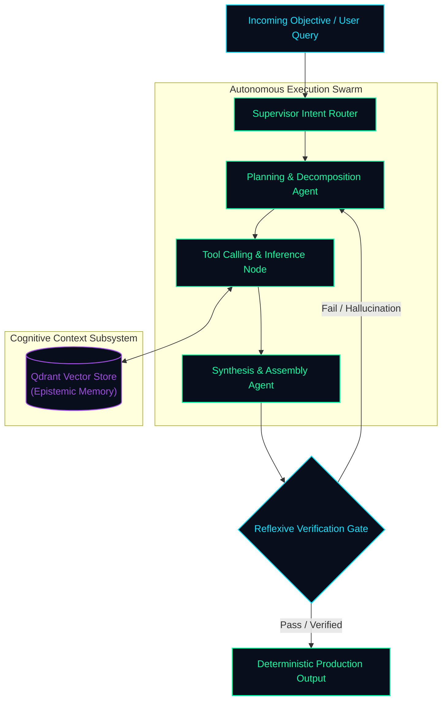

<!-- ═══════════════════════════════════════════════════════════════════════ -->
<!--               ◈ RAJAN MISHRA // NEURAL SYSTEMS ARCHITECT ◈               -->
<!-- ═══════════════════════════════════════════════════════════════════════ -->

<div align="center">

  <!-- HOLOGRAPHIC QUANTUM BANNER -->
  

  <br/><br/>

  <!-- TERMINAL TELEMETRY TYPING SUBTITLE -->
  <a href="https://github.com/aiwithrajan">
    
  </a>

  <br/><br/>

  <!-- ACTION BUTTONS / SOCIAL UPLINKS -->
  <a href="mailto:imrajan098@gmail.com">
    
  </a>
  &nbsp;
  <a href="https://linkedin.com/in/rajanmishra01" target="_blank">
    
  </a>
  &nbsp;
  <a href="https://x.com/RajanMi26020288" target="_blank">
    
  </a>
  &nbsp;
  <a href="https://huggingface.co/rajanmishra123" target="_blank">
    
  </a>
  &nbsp;
  <a href="https://github.com/aiwithrajan?tab=repositories" target="_blank">
    
  </a>

  <br/><br/>

  <!-- QUANTUM DIVIDER -->
  

  <!-- SYSTEM TELEMETRY STRIP -->
  <p align="center">
    
    &nbsp;&nbsp;
    
    &nbsp;&nbsp;
    
    &nbsp;&nbsp;
    
  </p>

</div>

<br/>

### `◈ 01 // INTEL_MANIFEST`

```text
╭────────────────────────────────────────────────────────────────────────────────────────╮
│  OPERATOR        : Rajan Mishra                                                        │
│  DISCIPLINE      : AI Systems Engineer & Autonomous Agent Architect                    │
│  CORE MISSION    : Building resilient, deterministic intelligence on top of LLMs      │
│  SPECIALTIES     : Multi-Agent Swarms · Self-Healing Pipelines · Low-Latency RAG       │
│  INFRASTRUCTURE  : Python · FastAPI · LangGraph · PyTorch · Qdrant · PostgreSQL        │
│  BUILD DOCTRINE  : Research with depth ──> Architect with rigor ──> Deploy at scale    │
╰────────────────────────────────────────────────────────────────────────────────────────╯
```

#### Core Engineering Pillars

| Pillar | Engineering Execution |
| :--- | :--- |
| **🤖 Autonomous Agent Swarms** | Orchestrating multi-agent state graphs, dynamic supervisor routing, deterministic tool validation, and reflexive error loops. |
| **🔍 Cognitive Retrieval (RAG)** | Hybrid dense-sparse search, reciprocal rank fusion (RRF), cross-encoder re-ranking, and dynamic vector clustering. |
| **⚡ High-Throughput Backends** | Asynchronous FastAPI microservices, streaming SSE / WebSocket architectures, and low-latency local model inference. |
| **🛡️ Guardrails & Evaluation** | Typed structured JSON schemas, hallucination detection layers, automated prompt benchmarking, and observability. |

<br/>


<br/>

### `◈ 02 // NEURAL_STACK & TOOLING`

<div align="center">
  
</div>

<br/>

```ini
[INTELLIGENCE_LAYER]
PyTorch · LangChain · LangGraph · LlamaIndex · HuggingFace · Ollama · vLLM · CrewAI

[BACKEND_&_APIS]
FastAPI · Python · Node.js · Express · RESTful APIs · Server-Sent Events (SSE) · WebSockets

[FRONTEND_&_INTERACTION]
TypeScript · React · Next.js · Tailwind CSS · Vite · Interactive Web Visualizations

[STORAGE_&_VECTORS]
Qdrant · PostgreSQL · Supabase · ChromaDB · Redis · Pinecone · SQLite

[DEVOPS_&_PLATFORMS]
Docker · Kubernetes · AWS Cloud · Cloudflare · Linux / Bash · GitHub Actions (CI/CD)
```

<br/>


<br/>

### `◈ 03 // ARCHITECTURAL BLUEPRINT`

> **Dynamic Multi-Agent Swarm with Self-Correction & Verification Loop**



<br/>


<br/>

### `◈ 04 // ACTIVE LABS & REPOSITORIES`

| System | Classification | Tech Stack | Status |
| :--- | :--- | :--- | :--- |
| [**Autonomous Agent Swarm**](https://github.com/aiwithrajan) | Distributed Multi-Agent Engine | Python, LangGraph, FastAPI, Docker | `● ACTIVE DEV` |
| [**Hybrid RAG Search Platform**](https://github.com/aiwithrajan) | Dense/Sparse Vector Search Engine | Qdrant, PyTorch, Next.js, TypeScript | `● SHIPPED` |
| [**Agentic Developer Assistant**](https://github.com/aiwithrajan) | Automated Code Evaluation & Refactor | Ollama, LangChain, CLI | `● OPEN SOURCE` |
| [**FastAPI AI Gateway**](https://github.com/aiwithrajan) | High-Concurrency Model Serving | FastAPI, Redis, Docker, vLLM | `● PRODUCTION` |

<br/>


<br/>

### `◈ 05 // SYSTEM METRICS & COMMITS`

<div align="center">
  
  &nbsp;
  
</div>

<br/>

<div align="center">
  
</div>

<br/>


<br/>

### `◈ 06 // SECURE UPLINK & TRANSMISSION`

```bash
$ rajan --connect
Connecting to operator node...
[+] Email    : imrajan098@gmail.com
[+] LinkedIn : https://linkedin.com/in/rajanmishra01
[+] X        : https://x.com/RajanMi26020288
[+] GitHub   : https://github.com/aiwithrajan
```

<p align="center">
  <a href="mailto:imrajan098@gmail.com">
    
  </a>
  &nbsp;&nbsp;
  <a href="https://linkedin.com/in/rajanmishra01" target="_blank">
    
  </a>
  &nbsp;&nbsp;
  <a href="https://x.com/RajanMi26020288" target="_blank">
    
  </a>
</p>

<p align="center">
  
</p>
